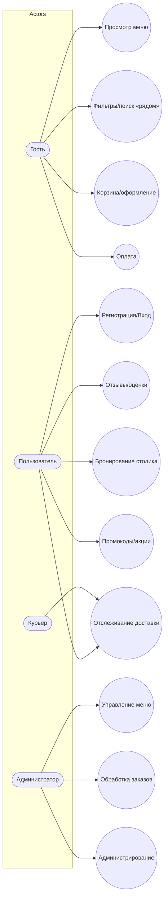

## Краткое описание задачи
Сеть ресторанов с функциями: поиск и фильтрация ресторанов/меню, оформление заказа (доставка/самовывоз), оплата, трекинг курьера, отзывы, акции, бронирования.

## Use Case

## Сценарии (кратко)
- **Быстрый ланч с гарантией ETA (Артём)** — push→«Быстрый повтор», ETA≤12 мин, оплата 1 кликом.
- **Семейный ужин (Анна)** — фильтры по аллергенам, семейные наборы, подсказка до «бесплатной доставки».
- **Ночной заказ (Михаил)** — ночной режим, 3–5 проверенных ресторанов, «не звонить, оставить у двери».
- **Простой повтор (Елена)** — «Простой режим», «Заказать также», SMS‑статусы.
- **Анти‑персона (Максим)** — антифрод, лимиты, модерация.

## MVP
Каталог/меню, корзина, оплата, трекинг, отзывы, акции; авторизация, адреса, уведомления; админ‑панель.
